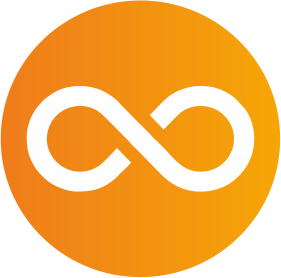
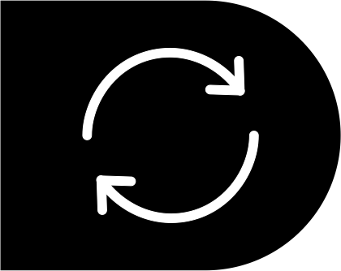

<html>
<head>
<meta charset="utf-8">
<meta name="viewport" content="width=device-width, initial-scale=1">
<link rel="stylesheet" href="style1.css">

<link rel="stylesheet" href="https://maxcdn.bootstrapcdn.com/bootstrap/3.3.7/css/bootstrap.min.css" integrity="sha384-BVYiiSIFeK1dGmJRAkycuHAHRg32OmUcww7on3RYdg4Va+PmSTsz/K68vbdEjh4u" crossorigin="anonymous">
<!-- Optional theme -->
<link rel="stylesheet" href="https://maxcdn.bootstrapcdn.com/bootstrap/3.3.7/css/bootstrap-theme.min.css" integrity="sha384-rHyoN1iRsVXV4nD0JutlnGaslCJuC7uwjduW9SVrLvRYooPp2bWYgmgJQIXwl/Sp" crossorigin="anonymous">

<title>zet-mobile</title>
</head>
<body>

	<nav class="navbar navbar-default " style="background: black ; margin: 0; ">
		

			

				

					
				

				<ul class="nav navbar-nav" style="padding-right: 600px;">
				<li><a href="#">Для бизнеса</a></li>
				<li ><a href="#">Скидки </a></li>
				</ul>
				<ul class="nav navbar-nav">
				<li ><a href="#">Поиск</a></li>
				<li ><a href="#">Личный кабинет </a></li>
				</ul>
		

	</nav>
	<nav class="navbar navbar-default " style="background: white ;">
		

			

				<ul class=" nav navbar-nav" >
					<li type="button"><a href="#">Тарифы</a></li>
					<li type="button"><a href="#">Мобильный интернет</a></li>
					<li type="button"><a href="#">Услуги</a></li>
					<li type="button"><a href="#">Новости </a></li>
					<li type="button"><a href="#">Роуминг</a></li>
				</ul>
				

		

	</nav>
	 
	

		

		<button class="btn3">Безлимитный интернет</button>
		<button class="btn4">Тарифы</button>
		

	

		 
	

		

			

				

					<h3>Хаматарафа +59</h3>
					<button class="btn1">Хит продаж</button>
					 
					

						

						&emsp;
						
59 мин

					

					

						

						&emsp;
						
2500 МБ

					

					

						

						&emsp;
						
<normal>Безлимит на мессенджеры</normal>
							 
						
						
						
						

					

					  
					

						

						
Безлимит на Imo и Telegram

					

					          
					

						

						&emsp;
						<h6>Копи неизрасходованные ГБ и минуты </h6>
					

					

						

						&emsp;
						<h6>Легко передавай свои ГБ и минуты</h6>
					
                            
					

						

						&emsp;
						<h6>Меняй минуты,SMS на ГБ,и наоборот</h6>
					

					

						

							
<h1>59 с</h1>в месяц

						

						

							 
							
<normal>Подробнее</normal> <button class="btn6"><a href="#">Купить</a></button>

						

					

				

				

					<h3>Хаматарафа +100</h3>
					<button class="btn2">Хит продаж</button>
					 
					

						

						&emsp;
						
Безлимит внутри сети

					

					

						

						&emsp;
						
100 мин на другие сети

					

					

						

						&emsp;
						
1000 МБ

						

						

							

							&emsp;
							
Безлимит на YouTube  

							

						

						

						&emsp;
						
<normal>Безлимит на мессенджеры</normal>
							 
						
						
						
						

					

					         
					

						

						&emsp;
						<h6>Копи неизрасходованные ГБ и минуты </h6>
					

					

						

						&emsp;
						<h6>Легко передавай свои ГБ и минуты</h6>
					
                            
					

						

						&emsp;
						<h6>Меняй минуты,SMS на ГБ,и наоборот</h6>
					

					

						

							
<h1>100 с</h1>в месяц

						

							

								 
								
<normal>Подробнее</normal> <button class="btn6"><a href="#">Купить</a></button>

							

						

				

				

					<h3>Хаматарафа +200</h3>
					   
					

						

						&emsp;
						
Безлимит внутри сети

					

					

						

						&emsp;
						
200 мин на другие сети

					

					

						

						&emsp;
						
5000 МБ

						

						

							

							&emsp;
							
Безлимит на YouTube  

							

					

						

						&emsp;
						
<normal>Безлимит на  мессенджеры</normal>
							 
						
						
						
						

					

					 
					

						

						&emsp;
						
<normal>Безлимит на  социальные сети</normal>
							 
							
							
							
								
							
						

					

					      
					

						

						&emsp;
						<h6>Копи неизрасходованные ГБ и минуты </h6>
					

					

						

						&emsp;
						<h6>Легко передавай свои ГБ и минуты</h6>
					
                            
					

						

						&emsp;
						<h6>Меняй минуты,SMS на ГБ,и наоборот</h6>
					

					

						

							
<h1>200 с</h1>в месяц

						

						

							 
							
<normal>Подробнее</normal> <button class="btn6"><a href="#">Купить</a></button>

						

					

				

				

					<h3>Интернети шабона</h3>
					   
					

						

						&emsp;
						
<normal>Ночной безлимит с  00:00 до 07:00 без ограничения</normal>

					

					 
					

						

						&emsp;
						
<normal>Скорость приёма передачи/ передачи данных:  Максимальная</normal>

					

					                        
					

						

							
<h1>30 с</h1>в месяц

						

						

							 
							
<normal>Подробнее</normal> <button class="btn6"><a href="#">Купить</a></button>

						

					

				

			

		

	

	

	<h1><strong>Услуги</strong></h1>
	

		

			
<strong>Обмен трафика</strong>&emsp;&emsp;&emsp;&emsp;&emsp;

			
Lorem ipsum dolor sit amet consectetur adipisicing elit. Dolorum temporibus esse, nihil deserunt natus voluptatum nulla eos dolorem facilis atque omnis nostrum, libero maxime fugit quam repudiandae? Dolores, odit fuga!

		

		

			
			
<strong>Трансфер трафика</strong>&emsp;&emsp;&emsp;&emsp;

			
Lorem ipsum dolor sit amet consectetur adipisicing elit. Dolorum temporibus esse, nihil deserunt natus voluptatum nulla eos dolorem facilis atque omnis nostrum, libero maxime fugit quam repudiandae? Dolores, odit fuga!

		

		

			
<strong>Где ты?</strong>&emsp;&emsp;&emsp;&emsp;&emsp;&emsp;&emsp;&emsp;&emsp;

			
Lorem ipsum dolor sit amet consectetur adipisicing elit. Dolorum temporibus esse, nihil deserunt natus voluptatum nulla eos dolorem facilis atque omnis nostrum, libero maxime fugit quam repudiandae? Dolores, odit fuga!

		

	

	

		

			
<strong>Мобильный перевод</strong>&emsp;&emsp;&emsp;&emsp;&emsp;&emsp;&emsp;&emsp;&emsp;&emsp;&emsp;&emsp;&emsp;

			
Lorem ipsum dolor sit amet consectetur adipisicing elit. Dolorum temporibus esse, nihil deserunt natus voluptatum nulla eos dolorem facilis atque omnis nostrum, libero maxime fugit quam repudiandae? Dolores, odit fuga!

		

		

			
<strong>Помощь при нуле</strong>&emsp;&emsp;&emsp;&emsp;&emsp;&emsp;&emsp;&emsp;&emsp;&emsp;&emsp;&emsp;&emsp;&emsp;&emsp;

			
Lorem ipsum dolor sit amet consectetur adipisicing elit. Dolorum temporibus esse, nihil deserunt natus voluptatum nulla eos dolorem facilis atque omnis nostrum, libero maxime fugit quam repudiandae? Dolores, odit fuga!

		

	

	

	

	<h2>Наши приложения</h2>
	

	

		<!--Слайды-->
		

			

				

				
				

				       
				

					<h3 style="color: black;">Личный кабинет</h3>
					
Lorem ipsum dolor sit amet consectetur adipisicing elit. Dolorum temporibus esse, nihil deserunt natus voluptatum nulla eos dolorem facilis atque omnis nostrum, libero maxime fugit quam repudiandae? Dolores, odit fuga!

				

			

			

				

				
			

			       
				

					<h3>Второй слайд</h3>
					
zet-mobile

				

			

			

				

				
			

			       
				

					<h3>Третий слайд</h3>
					
zet-mobile

				

			

		

		<!--Стрелки переключения слайдов-->
		<a href="#carousel" class="left carousel-control" data-slide="prev" style="background-color:rgb(238, 123, 15);width:90px;height:90px;top:230px;left:500px;border-radius:10px;align-items:center ;">
			
		</a>
		<a href="#carousel" class=" right carousel-control" data-slide="next" style="background-color:rgb(238, 123, 15);width: 90px;height:90px;top:230px;right:500px;border-radius:10px;align-items:center ; " >
			
		</a>
	

	

		
		<h4>О нас 
		  		
		О компании
		 			
		Вакансии
		 			
		Новости	
		 		
		Контакты
		 	
		Договор	</h4>
		<h4>Помощь
		 
		Часто задаваемые вопросы?
		 
		Настройка интернета
		 
		Полезные команды
		 
		Карта покрытия
		 
		Карта покрытия
		</h4>
	

		 
		 
	

		

			

				<normal>&copy;ZET-MOBILE 2021</normal>
			

			

				
				
				
				
				
				
			

		

	

<!--jQuery-->

<!-- Latest compiled and minified JavaScript -->

</body>
</html>
